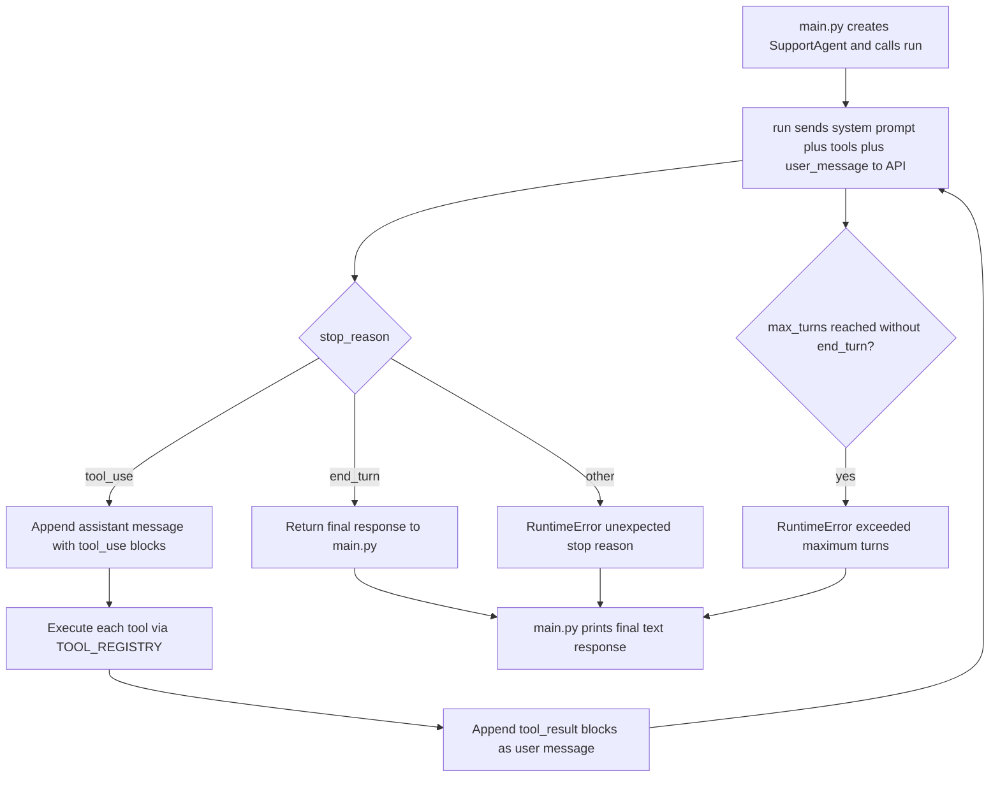

# ticket-triage — Agent Loop

## Summary

The triage program evolved from a single LLM call into a **tool-using agent
loop**. A `SupportAgent` iteratively calls the Anthropic API. When the model
requests information via **tool use**, the agent executes the tool locally,
feeds the result back, and repeats — until the model returns a final
`end_turn` response or the turn budget is exhausted.

Currently the agent has one tool: **`get_customer_status`**, a stub that
returns the account status (`active` / `suspended` / `unknown`) for a
customer id from the hard-coded lookup (C001, C002 active; C003 suspended).

## Program flow



## Agent loop details

1. **`run(user_message)`** — `SupportAgent.run` builds the `messages` list
   starting with the user's message.
2. **`call_llm`** — calls `client.messages.create` with the system prompt,
   conversation history, and available `TOOL_SCHEMAS`.
3. **Stop-reason dispatch**:
   - **`end_turn`** → return the response (final answer).
   - **`tool_use`** → append the assistant tool-use content to `messages`,
     execute the requested tools, append `tool_result` blocks as a user
     message, and loop back to the API.
   - anything else → `RuntimeError`.
4. **Max-turns guard** — if no `end_turn` arrives within `max_turns`
   (default 5), raise `RuntimeError`.

## Components

- **`SupportAgent`** — the loop driver (`__init__(max_turns=5)`, `run`,
  `_execute_tool`).
- **`call_llm`** — thin wrapper around the Anthropic Messages API; passes
  `tools` only when provided.
- **`get_customer_status`** — stub tool implementation used to answer
  account-status questions.
- **`CUSTOMER_STATUS_TOOL` / `TOOL_SCHEMAS` / `TOOL_REGISTRY`** — declarative
  tool schema vs. executable registry lookup.
- **`TRIAGE_SYSTEM_PROMPT`** — instructs the model when/in which style to
  answer.
- **Models** (`SupportTicket`, `TicketCategory`, `TicketPriority`,
  `TriageResult`) — pydantic models retained from the baseline.
- **`main.py`** — entrypoint: creates the agent and runs a canned customer
  message, printing the final text response.

## Running

```bash
uv run python -m support_agent.main   # run from ticket-triage/
uv run pytest                        # run the test suite
```

> Note: `triage_ticket` in `agent.py` still references the old `ask_llm`
> helper (renamed to `call_llm`) and is no longer used by `main.py`.
> Consider removing it in a later iteration.